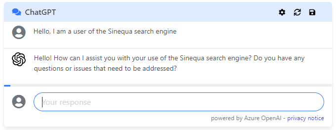
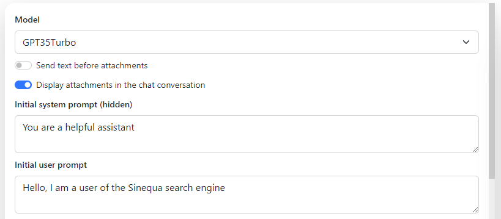
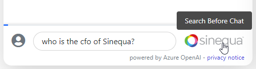
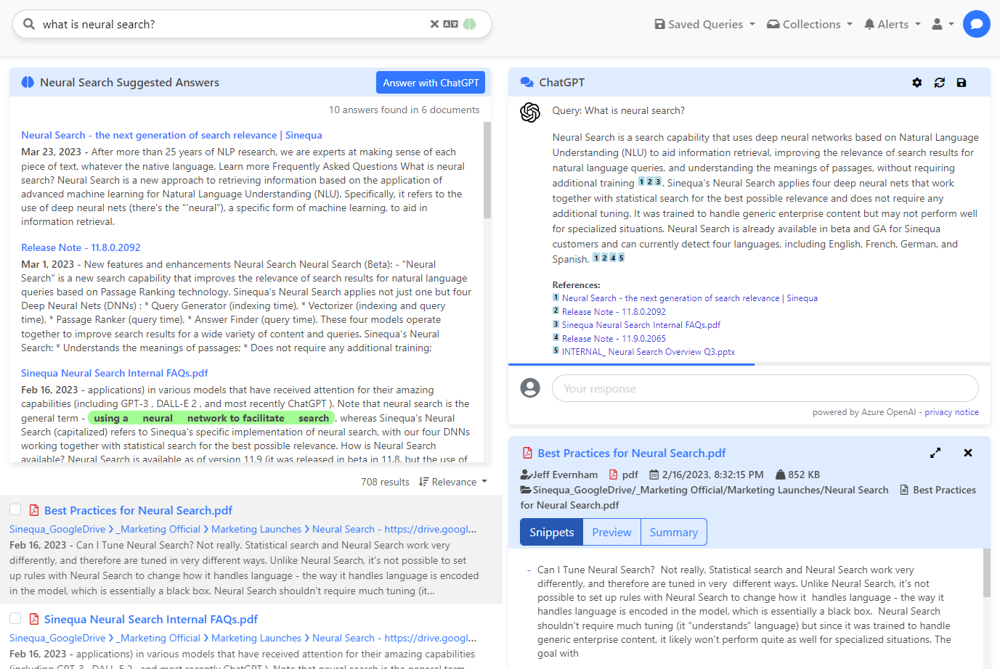
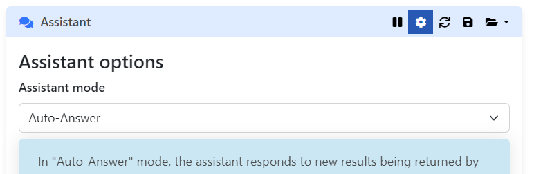
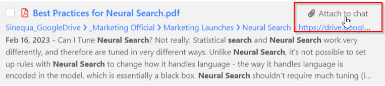
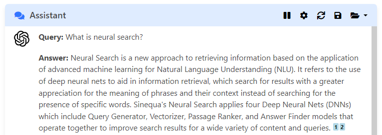
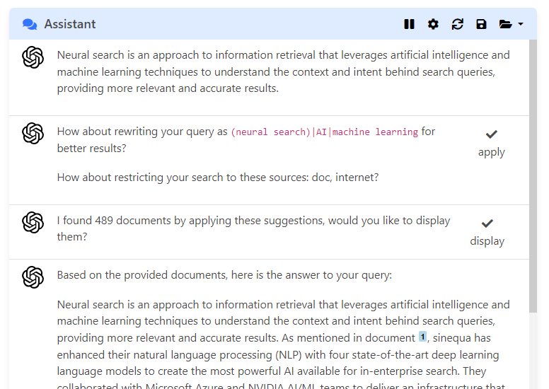
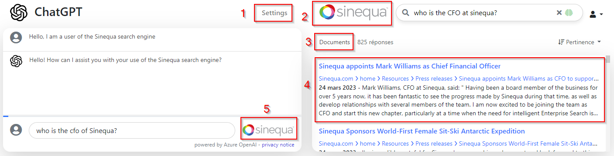

# Sinequa ChatGPT Integration

Sinequa brings ChatGPT to your organization using your data. This integration relies on the **Azure OpenAI Service** and GPT Models (GPT3.5 & GPT4)

<p align="center">

</p>

* [Installation steps](#installation_steps)
    * [Plugin](#installation_steps_plugin)
    * [Environment variables](#installation_steps_plugin_env_vars)
        * [Azure Cognitive Service - Azure OpenAI](#installation_steps_plugin_env_vars_azure)
        * [Prompts](#installation_steps_plugin_env_vars_prompts)
        * [User quota](#installation_steps_plugin_env_vars_quota)
    * [SBA](#installation_steps_sba)
* [ChatGPT SBA integration](#sba_integration)
    * [Chat component](#sba_integration_chat_component)
        * [General options](#sba_integration_chat_options)
        * [Advanced options](#sba_integration_chat_adv_options)
    * [Vanilla Search integration](#sba_integration_vanilla)
		* [Assistant](#sba_integration_vanilla_assistant)
		* [Other integrations](#sba_integration_vanilla_other)
		* [Prompt customization](#sba_integration_vanilla_prompts)
    * [ChatGPT application](#sba_integration_chat_app)
* [Endpoint](#endpoint)
    * [List Models](#endpoint_list_models)
    * [Token Count](#endpoint_token_count)
    * [Chat](#endpoint_chat)
* [Azure OpenAI data, privacy and security policy](#azure_openai_policy)

<br/>
<br/>

# <a name="installation_steps"></a> Installation steps

To deploy the Sinequa ChatGPT in your environment you need the following prerequisites:
- Sinequa V11.10.0
- Neuralized documents (indexed with Neural Search)
- GLLM plugin installed and compiled
- .Net Core WebApp - Kestrel 
- Access to the [Azure OpenAI ChatGPT preview](https://azure.microsoft.com/en-us/blog/chatgpt-is-now-available-in-azure-openai-service/)

<br/>

## <a name="installation_steps_plugin"></a> Plugin

1. Copy the `GLLM` plugin folder to your `˂sinequa_data˃/configuration/plugins` folder
1. Copy the dlls from `libs` to the `<sinequa>/bin` folder.
    - `Azure.AI.OpenAI.dll` from `Libs\azure.ai.openai\1.0.0-beta.5\netstandard2.0`
    - `TiktokenSharp.dll` from `Libs\tiktokensharp\1.0.4\netstandard2.1`
1. Build the plugin

<br/>

## <a name="installation_steps_plugin_env_vars"></a> Environment variables

<br/>

### <a name="installation_steps_plugin_env_vars_azure"></a> Azure Cognitive Service - Azure OpenAI

For the plugin to work, you must set the following:
- `azure-openai-api-url`
- `azure-openai-api-key`
<br/> and one of the following model deployment names
- `azure-openai-gpt-35-deployment-name` or `azure-openai-gpt4-8k-deployment-name` or `azure-openai-gpt4-32k-deployment-name`

Name | Type | Comment |
--- | --- | --- |
`azure-openai-api-url` | string | *Azure OpenAI* endpoint. This information can be found in the *overview* of the *Azure Cognitive Service, Azure OpenAI* on the Azure Portal. <br/> Example: https://`<Azure OpenAI Name>`.openai.azure.com/
`azure-openai-api-key` | string | *Azure OpenAI* Key. This information can be found in the *Keys and Endpoint* of The *Azure Cognitive Service, Azure OpenAI* on the Azure Portal.
`azure-openai-gpt-35-deployment-name` | string | *Model deployment name*. Name of the `	gpt-35-turbo` model. This information can be found in the *Model and deployments* of the *Azure Cognitive Service, Azure OpenAI* on the Azure Portal.
`azure-openai-gpt4-8k-deployment-name` | string | *Model deployment name*. Name of the `	gpt4-8k` model. This information can be found in the *Model and deployments* of the *Azure Cognitive Service, Azure OpenAI* on the Azure Portal.
`azure-openai-gpt4-32k-deployment-name` | string | *Model deployment name*. Name of the `	gpt4-32k` model. This information can be found in the *Model and deployments* of The *Azure Cognitive Service, Azure OpenAI* on the Azure Portal.

To learn more, read the following  Microsoft documentation: [Create a resource and deploy a model using Azure OpenAI](https://learn.microsoft.com/en-us/azure/cognitive-services/openai/how-to/create-resource?pivots=web-portal)

<br/>

### <a name="installation_steps_plugin_env_vars_prompts"></a> Prompts

Name | Type | Comment |
--- | --- | --- |
`azure-openai-gpt-35-prompt-protection` | string | A user prompt that gets injected by the backend before the last user prompt. This is typically used to restrict user interactions with the model. This environment variable is optional.

<br/>

### <a name="installation_steps_plugin_env_vars_quota"></a> User quota

To prevent abuse or misuse of the ChatGPT custom endpoint, you can set a maximum quota per user, see `gllm-user-quota-tokens` . The quota can be reset every N hours, see `gllm-user-quota-reset-hours`

Quota is stored in XML user settings.

Name | Type | Comment |
--- | --- | --- |
`gllm-user-quota-tokens` | int | Input and output tokens quota per user. Quota does not apply to Administrators. Use magic value `-1` to disable quota for all users.
`gllm-user-quota-reset-hours` | int | Time duration before the user quota resets. Value is expressed in hours. Minimum value is `1`.

<br/>

## <a name="installation_steps_sba"></a> SBA

New SBA components are available on the [SBA GitHub - Chatgpt-integration branch](https://github.com/sinequa/sba-angular/tree/chatgpt-integration).

To learn more, read the [ChatGPT SBA integration](#sba_integration) section of the documentation.


<br/>
<br/>

# <a name="sba_integration"></a> ChatGPT SBA integration

ChatGPT is integrated in the SBA framework at different level:

- In the components library, the **machine-learning module** includes a new component `sq-chat` and a service `ChatService`.
- In the classical Vanilla-Search application, the chat component is integrated at different level to enhance the search experience. In particular, a new "Assistant" component uses ChatGPT to generate answers and improve search results.
- A new starter application named "chatgpt" is centered on the chat component. It provides a new type of experience in which chatting is the main purpose and content retrieval is performed behind the scene.

<br/>

## <a name="sba_integration_chat_component"></a> Chat component

The simplest possible usage of the chat component is as follows:

```html
<sq-chat [chat]="null"></sq-chat>
```

This displays a chat component, with all default inputs (the `null` input is needed if no other input is provided to the component).

This component can be integrated in a facet card, like so:

```html
<sq-facet-card [title]="'ChatGPT'" [icon]="'fas fa-comments primary-icon'">
    <sq-chat #facet [chat]="null"></sq-chat>
</sq-facet-card>
```



<br/>

### <a name="sba_integration_chat_options"></a> General options

The `sq-chat` component has a long list of options, which can be seen in the component's [source code](https://github.com/sinequa/sba-angular/blob/chatgpt-integration/projects/components/machine-learning/chat/chat.component.ts).

Most of these options can be tuned via the `sq-chat-settings` component, which displays a form with all these options:

```html
<sq-chat-settings [config]="chatConfig"></sq-chat-settings>
```

(When modified, these options need to be persisted separately an binded to the `sq-chat` component's input)



<br/>

### <a name="sba_integration_chat_adv_options"></a> Advanced options

The `sq-chat` component has other options that can give it a different purpose or user experience:

- `searchMode` when set to `true`, this enables "auto-search". This lets users trigger a Sinequa search query that constructs "attachments" (snippets of text from documents) that they can then inject in the conversation with ChatGPT. Auto-search is triggered directly from the Chat's input, by pressing the `Tab` key, or by click the Sinequa logo displayed to the right of the search bar.

  

- `enableChat` when set to `false` disables the chat, so in effect in displays one single message from ChatGPT generated from one (generally hidden) prompt.
- `chat` allows to open a predefined conversation in the chat component. These conversations may be `SavedChat` (conversations manually saved by the user), or programmatically-constructed conversation starters (for example _"take these documents and build a summary"_).

An example of programmatically constructed chat can be found below:

```ts
const passages = this.searchService.results?.topPassages?.passages;
if(passages?.length) {
  const attachments = this.chatService.addTopPassages(passages, []);
  const prompt = `Please generate a summary of these passages`;
  const messages = [
    {role: 'system', display: false, content: prompt}
  ];
  this.chat = {messages, attachments};
}
```

and in the template:

```html
<sq-chat [chat]="chat"></sq-chat>
```

<br/>

## <a name="sba_integration_vanilla"></a> Vanilla Search integration



The `sq-chat` component is integrated in Vanilla Search at different levels. Note that these integrations are just **samples** to demonstrate the range of possibilities, rather than a definite and refined application design.

<br/>

### <a name="sba_integration_vanilla_assistant"></a> Assistant

The most prominent feature is the "Assistant" displayed on the search page. This assistant component displays the chat inside a facet card, manages the chat's settings and performs certain actions in response to user search queries.

The assistant has different "modes" that can be activated in the settings:



There are currently four available modes:

- Manual: The assistant does nothing automatically. The user must manually select documents from the result list to inject them into the chat conversation




- Auto-Search: The assistant does nothing automatically, but it lets users trigger search queries directly from the chat's text input (with the `Tab` key or with a click on the Sinequa Logo). The assistant automatically runs the search, selects relevant passages and injects them in the conversation.


- Auto-Answer: The assistant responds to the user's search queries: when results are retrieved, the assistant automatically selects relevant passages, injects them in the conversation and prompts ChatGPT for a short answer and a summary.



- Meeseeks mode: The assistant eagerly tries to enhance the user's search queries by trying to correct/expand the fulltext search and by adding filters (as if it were clicking in facets). It then runs the modified search query in the background, and uses the results to provide an answer to the question, similarly as in Auto-search mode. Note that Meeseeks mode makes use of GPT4 specifically (as GPT3.5 is not reliable enough for the task).



<br/>

### <a name="sba_integration_vanilla_other"></a> Other integrations

- On the home page, we display a message generated by ChatGPT to greet users.
- In the search form a button allows to translate the content of the search bar to English (whatever the original language).
- On the results page, a new tab "Summary" is available in the "mini-preview". This summary is another instance of the ChatGPT component
- On the preview page, a new tab displays the chat. An initial summary is generated from the document's passages, and the user can continue the conversation and/or bring new content into the conversation, using "auto-search" (see above).

<br/>

### <a name="sba_integration_vanilla_prompts"></a> Prompt customization

It is possible to override the chat prompts used in these sample integrations in 2 ways:

- At user level, by customizing the prompts directly in the assistant's settings
- Or globally, by adding them as new properties in the "customization" tab of the application configuration in the Sinequa administration.

The customizable prompts are:

- `translatePrompt`
- `greetingPrompt`
- `previewPrompt` (summary displayed in the preview)
- `answerPrompt` (for the assistant's "auto-answer" mode)
- `searchPrompt` (for the assistant's "meeseeks" mode - search enhancement)
- `answer2Prompt` (for the assistant's "meeseeks" mode - answer generation)

It is also possible to customize the default [general options](#sba_integration_chat_options) of the chat with the `chatConfig` property (these options can still be customized at user level via the `sq-chat-settings` component).

Prompts may include placeholders refering to the properties of various objects (the current search query, the user's identity, etc.). For example, the "greeting prompt" of the home page reads as follows:

```
User {principal.fullName} is on the home page of the Sinequa search engine, please write a nice short 1-sentence greeting message in {locale.name}.
```
<br />

## <a name="sba_integration_chat_app"></a>ChatGPT application

The ChatGPT application uses the same components as in Vanilla Search, but it puts more emphasis on the chat, and particularly on the "Auto-Search" functionality.



1- The Settings view displays `sq-chat-settings` and lets users customize prompts and model parameters

2- The top Sinequa button lets users toggle the search view On and Off

3- The "Documents" / "Snippets" button lets users toggle between a document-centric view and a snippet centric view (Snippet being retrieved via Neural Search)

4- Clicking on the document opens the document's preview (it is also possible to add attachment to the chat that way)

5- The bottom Sinequa buttons lets users trigger "auto search", which triggers a search query with the content of the chat's user input. The search can be refined further using the search interface on the right side.

<br/>
<br/>

# <a name="endpoint"></a> Endpoint

There is a unique endpoint: `GLLM`.

You can call the endpoint using the following URI: `<host>/api/v1/dev.plugin?plugin=GLLM`.

The endpoint only accepts `POST` requests.

You must specify the `action` in the raw body payload:

Parameters:
Name | Type | Mandatory | Default value | Comment |
--- | --- | :----: | --- | --- |
`action` | string | X | | `listmodels` \| `tokencount` \| `chat`
`debug` | bool | | | enable debug mode

<br/>

## <a name="endpoint_list_models"></a> List Models

Returns the list of available models (model type) that can be used by the client. Only models that have been configured in the environment variables for [Azure Cognitive Service - Azure OpenAI](#installation_steps_plugin_env_vars_azure) will be listed.

Input sample:
```json
{
    "action": "listmodels"
}
```

Output sample:
```json
{
    "models": [
        {
            "name": "GPT35Turbo",
            "displayName": "Azure OpenAI - GPT3.5 Turbo",
            "size": 4097,
            "provider": "OpenAI",
            "penaltyMin": 0.0,
            "penaltyMax": 1.0,
            "bestOfMin": 1,
            "bestOfMax": 10,
            "temperatureMin": 0.0,
            "temperatureMax": 2.0,
            "generateTokensMin": 1,
            "generateTokensMax": 2000,
            "topPMin": 0.0,
            "topPMax": 1.0
        },
        {
            "name": "GPT4-8K",
            "displayName": "Azure OpenAI - GPT4 - 8K",
            "size": 8192,
            "provider": "OpenAI",
            "penaltyMin": 0.0,
            "penaltyMax": 1.0,
            "bestOfMin": 1,
            "bestOfMax": 10,
            "temperatureMin": 0.0,
            "temperatureMax": 2.0,
            "generateTokensMin": 1,
            "generateTokensMax": 2000,
            "topPMin": 0.0,
            "topPMax": 1.0
        }
    ],
    "methodresult": "ok"
}
```

For now, supported models are:
- `GPT35Turbo` : [gpt-35-turbo](https://learn.microsoft.com/en-us/azure/cognitive-services/openai/concepts/models#gpt-3-models-1)
- `GPT4-8K` : [gpt-4](https://learn.microsoft.com/en-us/azure/cognitive-services/openai/concepts/models#gpt-4-models)
- `GPT4-32K` : [gpt-4-32k](https://learn.microsoft.com/en-us/azure/cognitive-services/openai/concepts/models#gpt-4-models)

To learn more, read the following Microsoft documentation:
- [Azure OpenAI Service pricing](https://azure.microsoft.com/en-us/pricing/details/cognitive-services/openai-service/)

- [Azure OpenAI Service REST API reference - Completions](https://learn.microsoft.com/en-us/azure/cognitive-services/openai/reference#completions)

<br/>

## <a name="endpoint_token_count"></a> Token Count

Returns the number of tokens from the text. Tokenizer depends on the model used.

Parameters:
Name | Type | Mandatory | Default value | Comment |
--- | --- | :----: | --- | --- |
`model` | string | X | | Model type from [List Models](#endpoint_list_models)
`text` | string array | X | | String array containing the text to count

Input sample:
```json
{
    "action": "tokencount",
    "model": "GPT35Turbo",
    "text": [
        "antidisestablishmentarianism",
        "Lorem Ipsum is simply dummy text of the printing and typesetting industry. Lorem Ipsum has been the industry's standard dummy text ever since the 1500s, when an unknown printer took a galley of type and scrambled it to make a type specimen book. It has survived not only five centuries, but also the leap into electronic typesetting, remaining essentially unchanged. It was popularised in the 1960s with the release of Letraset sheets containing Lorem Ipsum passages, and more recently with desktop publishing software like Aldus PageMaker including versions of Lorem Ipsum.",
        "Contrary to popular belief, Lorem Ipsum is not simply random text."
    ]
}
```

Output sample:
```json
{
    "tokens": [
        6,
        114,
        14
    ],
    "methodresult": "ok"
}
```

<br/>

## <a name="endpoint_chat"></a> Chat


Parameters:
Name | Type | Mandatory | Default value | Comment |
--- | --- | :----: | --- | --- |
`messagesHistory` | object | X | | see [messagesHistory](#param_msghistory) object
`model` | object | | | see [model](#param_model) object
`promptProtection` | bool || true | see [Prompts](#installation_steps_plugin_env_vars_prompts)

<a name="param_msghistory"></a> **messagesHistory** parameters:
Name | Type | Mandatory | Default value | Comment |
--- | --- | :----: | --- | --- |
role | string | X | | A description of the intended purpose of a message within a chat interaction completion (i.e., the output generated by the model). `system` \| `assistant` \| `user`
content | string | X | | Message content
display | bool | | false | If true, message will be displayed in the `sqChat` component
tokens | int | | | Content token count

<a name="param_model"></a> **model** parameters:
Name | Type | Mandatory | Default value | Comment |
--- | --- | :----: | --- | --- |
name | string | X | | Model type from [List Models](#endpoint_list_models)
temperature | double | | 0.7 | Sets the sampling temperature to use between 0 and 2. Higher values mean the model will take more risks. Try 0.9 for more creative applications and 0 (argmax sampling) for ones requiring a well-defined answer. We generally recommend altering this or top_p but not both.
generateTokens | int | | 800 | The maximum number of tokens to generate in the completion. The token count of your prompt plus max_tokens can't exceed the model's context length. Most models have a context length (max_tokens) of 2048 tokens (except for the newest models, which support 4096).
frequencyPenalty | double | | 0 | Positive values penalize new tokens based on whether they appeared in the text so far, increasing the model's likelihood to talk about new topics.
presencePenalty | double | | 0 | Positive values penalize new tokens based on their existing frequency in the text so far, decreasing the model's likelihood to repeat the same line verbatim.
topP | double | | 0.95 | An alternative to sampling with temperature called nucleus sampling where the model considers the results of the tokens with top_p probability mass. For example, 0.1 means only the tokens comprising the top 10% probability mass are considered. We generally recommend altering this or temperature but not both.

<br/>
<br/>

# <a name="azure_openai_policy"></a> Azure OpenAI data, privacy and security policy

[Data, privacy, and security for Azure OpenAI Service](https://learn.microsoft.com/en-us/legal/cognitive-services/openai/data-privacy)

>Is customer data processed by Azure OpenAI sent to OpenAI? No. Microsoft hosts the OpenAI models within our Azure infrastructure, and all customer data sent to Azure OpenAI remains within the Azure OpenAI service.

>Is customer data used to train the OpenAI models? No. We do not use customer data to train, retrain or improve the models in the Azure OpenAI Service.

>Prompts and completions. The prompts and completions data may be temporarily stored by the Azure OpenAI Service in the same region as the resource for up to 30 days. This data is encrypted and is only accessible to authorized Microsoft employees for (1) debugging purposes in the event of a failure, and (2) investigating patterns of abuse and misuse to determine if the service is being used in a manner that violates the applicable product terms. Note: When a customer is approved for modified abuse monitoring, prompts and completions data are not stored, and thus Microsoft employees have no access to the data.


