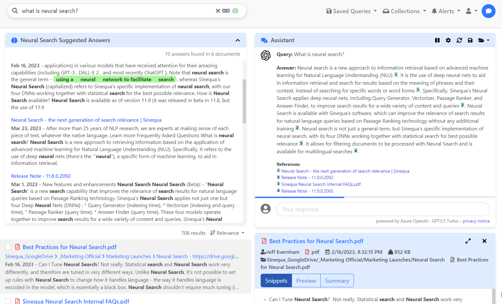

# Sinequa Retrieval Augmented Generation

Sinequa brings **Retrieval Augmented Generation** to your organization on **your data**. Search, analyze and chat with your enterprise data.

This integration is designed to be **model agnostic**: any **generative large language model** (Azure OpenAI GPT, Google PaLM, Cohere Command...) can be couple with the Sinequa platform. 

These pre-trained foundation models are usually trained offline, making the model agnostic to any data. However, they are trained on very general public domain data, making them less effective for enterprise specific tasks.

By using the Sinequa Retrieval Augmented Generation (RAG) to retrieve data from outside a foundation model you can augment your prompts by adding the relevant retrieved data in context.

The data used to augment your prompts is retrieved by Sinequa Neural Search (snippets & documents) to ensure that responses are based on the latest available information and can be traced back to the documents they originate from. 

Thanks to Sinequa complete library of pre-built features, quickly and securely connect your siloed content (200+ connectors) and make information in any format (300+ formats) discoverable from a single search entry point. Sinequa preserves and enforces information access controls from source systems. This means end-users only see the information they are entitled to see.

<br/><br/>
Sample of integration with Azure OpenAI GPT model:
<br/><br/>

<p align="center">

</p>

**Update**

June 30th 2023:
- New [providers and models](#providers_and_models): *Google PaLM2 Chat* & *Cohere Command*
- Support of *streaming* for Azure OpenAI GPT models (Kestrel WebAPp only). See [Chat](#endpoint_chat)
- New actions: [Answer](#endpoint_answer), [Context](#endpoint_context) and [Quota](#endpoint_quota)

<br/><br/>

* [Providers and models](#providers_and_models)
* [Installation steps](#installation_steps)
    * [Plugin](#installation_steps_plugin)
    * [Environment variables](#installation_steps_plugin_env_vars)
        * [Azure Cognitive Service - Azure OpenAI GPT](#installation_steps_plugin_env_vars_azure)
        * [Google Vertex AI - Text Chat](#installation_steps_plugin_env_vars_google)
        * [Cohere - Command Chat](#installation_steps_plugin_env_vars_cohere)
        * [User quota](#installation_steps_plugin_env_vars_quota)
    * [SBA](#installation_steps_sba)
* [ChatGPT SBA integration](#sba_integration)
    * [Chat component](#sba_integration_chat_component)
        * [General options](#sba_integration_chat_options)
        * [Advanced options](#sba_integration_chat_adv_options)
    * [Vanilla Search integration](#sba_integration_vanilla)
		* [Assistant](#sba_integration_vanilla_assistant)
		* [Other integrations](#sba_integration_vanilla_other)
		* [Prompt customization](#sba_integration_vanilla_prompts)
    * [ChatGPT application](#sba_integration_chat_app)
* [Endpoint](#endpoint)
    * [List Models](#endpoint_list_models)
    * [Token Count](#endpoint_token_count)
    * [Chat](#endpoint_chat)
    * [Answer](#endpoint_answer)
    * [Context](#endpoint_context)
    * [Quota](#endpoint_quota)
* [Azure OpenAI data, privacy and security policy](#azure_openai_policy)

<br/>
<br/>

# <a name="providers_and_models"></a> Providers and models

Below is a list of providers and models supported in by the Sinequa RAG implementation. 
In addition to the models listed below, you can implement ANY generative large language model using the GLLM plugin framework.  

Provider | Model | Max Tokens | Pricing | Data Privacy
--- | --- | --- | --- | --- |
[Microsoft Azure OpenAI](https://azure.microsoft.com/en-us/products/cognitive-services/openai-service) | [GPT 3.5 Turbo](https://learn.microsoft.com/en-us/azure/cognitive-services/openai/concepts/models#gpt-3-models-1) | 4,096 | [Azure OpenAI Service pricing](https://azure.microsoft.com/en-us/pricing/details/cognitive-services/openai-service/?cdn=disable) | [Data, privacy, and security for Azure OpenAI Service](https://learn.microsoft.com/en-us/legal/cognitive-services/openai/data-privacy?context=%2Fazure%2Fcognitive-services%2Fopenai%2Fcontext%2Fcontext)
[Microsoft Azure OpenAI](https://azure.microsoft.com/en-us/products/cognitive-services/openai-service) | [GPT 4](https://learn.microsoft.com/en-us/azure/cognitive-services/openai/concepts/models#gpt-4-models) | 8,192 | [Azure OpenAI Service pricing](https://azure.microsoft.com/en-us/pricing/details/cognitive-services/openai-service/?cdn=disable) | [Data, privacy, and security for Azure OpenAI Service](https://learn.microsoft.com/en-us/legal/cognitive-services/openai/data-privacy?context=%2Fazure%2Fcognitive-services%2Fopenai%2Fcontext%2Fcontext)
[Microsoft Azure OpenAI](https://azure.microsoft.com/en-us/products/cognitive-services/openai-service) | [GPT 4-32k](https://learn.microsoft.com/en-us/azure/cognitive-services/openai/concepts/models#gpt-4-models) | 32,768 | [Azure OpenAI Service pricing](https://azure.microsoft.com/en-us/pricing/details/cognitive-services/openai-service/?cdn=disable) | [Data, privacy, and security for Azure OpenAI Service](https://learn.microsoft.com/en-us/legal/cognitive-services/openai/data-privacy?context=%2Fazure%2Fcognitive-services%2Fopenai%2Fcontext%2Fcontext)
[Google](https://cloud.google.com/ai/generative-ai) | [PaLM2 chat-bison-001](https://cloud.google.com/vertex-ai/docs/generative-ai/chat/chat-prompts) | 4,096 | [Vertex AI pricing](https://cloud.google.com/vertex-ai/pricing) | [Cloud Data Processing](https://cloud.google.com/terms/data-processing-addendum)
[Cohere](https://cohere.com/) | [command-xlarge-beta](https://cohere.com/generate) | 4,096 | [Pricing](https://cohere.com/pricing) | [Security](https://cohere.com/security)


# <a name="installation_steps"></a> Installation steps

To deploy the Sinequa RAG in your environment you need the following prerequisites:
- Sinequa V11.10.0
- Neuralized documents (indexed with Neural Search)
- GLLM plugin installed and compiled
- Have access to a foundation model (Azure OpenAI GPT, Google PaLM, Cohere Command...)

<br/>

## <a name="installation_steps_plugin"></a> Plugin

NOTE: the plugin support both Kestrel and IIS WebApp. Depending on the WebApp type, you must copy different dlls and modify the plugin Programming Language.

1. Copy the `GLLM` plugin folder to your `˂sinequa_data˃/configuration/plugins` folder
1. Assembly references. Depending on the WebApp type you must to copy the following dlls:
    - Kestrel (.Net Core runtime), copy the following dlls from `libs` to the `<sinequa>/bin` folder.
        - `Azure.AI.OpenAI.dll` from `Libs\azure.ai.openai\1.0.0-beta.5\netstandard2.0`
        - `TiktokenSharp.dll` from `Libs\tiktokensharp\1.0.5\netstandard2.1`
    - IIS (.Net Framework runtime), copy the following dlls from `libs` to the `<sinequa>/website\bin` 
        - `Azure.AI.OpenAI.dll` from `Libs\azure.ai.openai\1.0.0-beta.5\netstandard2.0`
        - `TiktokenSharp.dll` from `Libs\tiktokensharp\1.0.5\netstandard2.0`
        - `IndexRange.dll` from `Libs\indexrange\1.0.2\netstandard2.0`
1. Build the plugin. Depending on the WebApp type you must adapt the `Programming Language` in the plugin 
    - Kestrel (.Net Core runtime), select `C# .NET 6.0` or higher
    - IIS (.Net Framework runtime), select `C# .NET Framework`
    - If you want to support both, select `C# .NET Framework & .NET 6.0` or higher. In this situation, dlls must have been copied in both `<sinequa>/bin` and `<sinequa>/website\bin` (see step #2)
1. [Optional] This plugin uses the [TiktokenSharp](https://github.com/aiqinxuancai/TiktokenSharp) library. When using a new encoder for the first time, the required tiktoken files for the encoder will be downloaded from the internet (ref: [p50k_base.tiktoken](https://openaipublic.blob.core.windows.net/encodings/p50k_base.tiktoken) and [cl100k_base.tiktoken](https://openaipublic.blob.core.windows.net/encodings/cl100k_base.tiktoken)). If you want, you can manually download these files and configure the `tikToken_GPT35` or `tikToken_GPT4` variables in the `AzureOpenAIModel.cs` file.


<br/>

## <a name="installation_steps_plugin_env_vars"></a> Environment variables

You must setup at least one model using the environment variables. Models are enabled when the environment variables are configured. Once configured, you can check the list of available models using the [List Models](#endpoint_list_models) endpoint.
* [Azure Cognitive Service - Azure OpenAI GPT](#installation_steps_plugin_env_vars_azure)
* [Google Vertex AI - Text Chat](#installation_steps_plugin_env_vars_google)
* [Cohere - Command Chat](#installation_steps_plugin_env_vars_cohere)

In addition to the model(s), you must configure user quota.
* [User quota](#installation_steps_plugin_env_vars_quota)

<br/>

### <a name="installation_steps_plugin_env_vars_azure"></a> Azure Cognitive Service - Azure OpenAI GPT

To enable Azure OpenAI GPT models, you must set the following:
- `azure-openai-api-url`
- `azure-openai-api-key`
<br/> and one of the following model deployment names
- `azure-openai-gpt-35-deployment-name` or `azure-openai-gpt4-8k-deployment-name` or `azure-openai-gpt4-32k-deployment-name`

Name | Type | Mandatory | Comment |
--- | --- | --- | --- |
`azure-openai-api-url` | string | Yes |  *Azure OpenAI* endpoint. This information can be found in the *overview* of the *Azure Cognitive Service, Azure OpenAI* on the Azure Portal. <br/> Example: https://`<Azure OpenAI Name>`.openai.azure.com/
`azure-openai-api-key` | string | Yes | *Azure OpenAI* Key. This information can be found in the *Keys and Endpoint* of The *Azure Cognitive Service, Azure OpenAI* on the Azure Portal.
`azure-openai-gpt-35-deployment-name` | string | Yes | *Model deployment name*. Name of the `	gpt-35-turbo` model. This information can be found in the *Model and deployments* of the *Azure Cognitive Service, Azure OpenAI* on the Azure Portal.
`azure-openai-gpt4-8k-deployment-name` | string | Yes | *Model deployment name*. Name of the `	gpt4-8k` model. This information can be found in the *Model and deployments* of the *Azure Cognitive Service, Azure OpenAI* on the Azure Portal.
`azure-openai-gpt4-32k-deployment-name` | string | Yes | *Model deployment name*. Name of the `	gpt4-32k` model. This information can be found in the *Model and deployments* of The *Azure Cognitive Service, Azure OpenAI* on the Azure Portal.
`azure-openai-prompt-protection` | string | No | User message that gets inserted before any user prompt. Goal is to inject instructions to the model while chatting. Can be used to mitigate hallucinations. Example of prompt protection: *answer only in the context of the documents, do not use your knowledge*

To learn more, read the following  Microsoft documentation: [Create a resource and deploy a model using Azure OpenAI](https://learn.microsoft.com/en-us/azure/cognitive-services/openai/how-to/create-resource?pivots=web-portal)

<br/>

### <a name="installation_steps_plugin_env_vars_google"></a> Google Vertex AI - Text Chat

To enable Google Vertex Text Chat model, you must set the following:
- `google-vertexai-model-id`
- `google-vertexai-endpoint`
- `google-vertexai-project-id`
- `google-vertexai-service-account-json-credentials`

For the Google Vertex - Text Chat integration you must use a service account in the Google console and set the `aiplatform.endpoints.predict` permission. To give generative AI feature access to service accounts, you can give the service account the role Vertex AI Service Agent `roles/aiplatform.serviceAgent`. <br/>
[See Google Access control documentation](https://cloud.google.com/vertex-ai/docs/generative-ai/access-control)

Name | Type | Mandatory | Comment |
--- | --- | --- | --- |
`google-vertexai-model-id` | string | Yes |  *Model ID*. This information can be found in the *Model Garden* of the *Vertex AI* section on the Google Cloud Console. <br/> Example: `chat-bison@001`
`google-vertexai-endpoint` | string | Yes | *API Endpoint*. This information can be found in the *Model Garden* of the *Vertex AI* section on the Google Cloud Console. <br/> Example: `us-central1-aiplatform.googleapis.com`
`google-vertexai-project-id` | string | Yes | *Project ID*. Project ID in your Organization. This information can be found on the Google Cloud Console.
`google-vertexai-service-account-json-credentials` | string | Yes | Path to the Service Account JSON private key file. Must be accessible from all WebApps. File can be downloaded from the *APIs & Services, Credentials* section on the Google Cloud Console.
`google-vertexai-prompt-protection` | string | No | User message that gets inserted before any user prompt. Goal is to inject instructions to the model while chatting. Can be used to mitigate hallucinations. Example of prompt protection: *answer only in the context of the documents, do not use your knowledge*
<br/>


### <a name="installation_steps_plugin_env_vars_cohere"></a> Cohere - Command Chat

To enable Cohere Command model, you must set the following:
- `cohere-generate-endpoint`
- `cohere-generate-api-key`
- `cohere-tokenizer-endpoint`
- `cohere-generate-prompt-protection`

Cohere integration rely on Cohere the public REST API.

Name | Type | Mandatory | Comment |
--- | --- | --- | --- |
`cohere-generate-endpoint` | string | Yes | *Co.Generate API Endpoint*. This information can be found in the *API Reference* on the Cohere Website.
`cohere-generate-api-key` | string | Yes | *API Key*.
`cohere-tokenizer-endpoint` | string | Yes | *Co.Tokenize API Endpoint*. This information can be found in the *API Reference* on the Cohere Website.
`cohere-generate-prompt-protection` | string | No | User message that gets inserted before any user prompt. Goal is to inject instructions to the model while chatting. Can be used to mitigate hallucinations. Example of prompt protection: *answer only in the context of the documents, do not use your knowledge*

### <a name="installation_steps_plugin_env_vars_quota"></a> User quota

To prevent abuse or misuse of the ChatGPT custom endpoint, you can set a maximum quota per user, see `gllm-user-quota-tokens` . The quota can be reset every N hours, see `gllm-user-quota-reset-hours`

Quota is stored in XML user settings.

Name | Type | Comment |
--- | --- | --- |
`gllm-user-quota-tokens` | int | Input and output tokens quota per user. Quota does not apply to Administrators. Use magic value `-1` to disable quota for all users.
`gllm-user-quota-reset-hours` | int | Time duration before the user quota resets. Value is expressed in hours. Minimum value is `1`.

<br/>

## <a name="installation_steps_sba"></a> SBA

New SBA components are available on the [SBA GitHub - Chatgpt-integration branch](https://github.com/sinequa/sba-angular/tree/chatgpt-integration).

To learn more, read the [ChatGPT SBA integration](#sba_integration) section of the documentation below.


<br/>
<br/>

# <a name="sba_integration"></a> ChatGPT SBA integration

ChatGPT is integrated in the SBA framework at different level:

- In the components library, the **machine-learning module** includes a new component `sq-chat` and a service `ChatService`.
- In the classical Vanilla-Search application, the chat component is integrated at different level to enhance the search experience. In particular, a new "Assistant" component uses ChatGPT to generate answers and improve search results.
- A new starter application named "chatgpt" is centered on the chat component. It provides a new type of experience in which chatting is the main purpose and content retrieval is performed behind the scene.

<br/>

## <a name="sba_integration_chat_component"></a> Chat component

The simplest possible usage of the chat component is as follows:

```html
<sq-chat [chat]="null"></sq-chat>
```

This displays a chat component, with all default inputs (the `null` input is needed if no other input is provided to the component).

This component can be integrated in a facet card, like so:

```html
<sq-facet-card [title]="'ChatGPT'" [icon]="'fas fa-comments primary-icon'">
    <sq-chat #facet [chat]="null"></sq-chat>
</sq-facet-card>
```


<br/>

### <a name="sba_integration_chat_options"></a> General options

The `sq-chat` component has a long list of options, which can be seen in the component's [source code](https://github.com/sinequa/sba-angular/blob/chatgpt-integration/projects/components/machine-learning/chat/chat.component.ts).

Most of these options can be tuned via the `sq-chat-settings` component, which displays a form with all these options:

```html
<sq-chat-settings [config]="chatConfig"></sq-chat-settings>
```

(When modified, these options need to be persisted separately an binded to the `sq-chat` component's input)


<br/>

### <a name="sba_integration_chat_adv_options"></a> Advanced options

The `sq-chat` component has other options that can give it a different purpose or user experience:

- `searchMode` when set to `true`, this enables "auto-search". This lets users trigger a Sinequa search query that constructs "attachments" (snippets of text from documents) that they can then inject in the conversation with ChatGPT. Auto-search is triggered directly from the Chat's input, by pressing the `Tab` key, or by click the Sinequa logo displayed to the right of the search bar.

  

- `enableChat` when set to `false` disables the chat, so in effect in displays one single message from ChatGPT generated from one (generally hidden) prompt.
- `chat` allows to open a predefined conversation in the chat component. These conversations may be `SavedChat` (conversations manually saved by the user), or programmatically-constructed conversation starters (for example _"take these documents and build a summary"_).

An example of programmatically constructed chat can be found below:

```ts
const passages = this.searchService.results?.topPassages?.passages;
if(passages?.length) {
  const attachments = this.chatService.addTopPassages(passages, []);
  const prompt = `Please generate a summary of these passages`;
  const messages = [
    {role: 'system', display: false, content: prompt}
  ];
  this.chat = {messages, attachments};
}
```

and in the template:

```html
<sq-chat [chat]="chat"></sq-chat>
```

<br/>

## <a name="sba_integration_vanilla"></a> Vanilla Search integration



The `sq-chat` component is integrated in Vanilla Search at different levels. Note that these integrations are just **samples** to demonstrate the range of possibilities, rather than a definite and refined application design.

<br/>

### <a name="sba_integration_vanilla_assistant"></a> Assistant

The most prominent feature is the "Assistant" displayed on the search page. This assistant component displays the chat inside a facet card, manages the chat's settings and performs certain actions in response to user search queries.

The assistant has different "modes" that can be activated in the settings:


There are currently four available modes:

- Manual: The assistant does nothing automatically. The user must manually select documents from the result list to inject them into the chat conversation


- Auto-Search: The assistant does nothing automatically, but it lets users trigger search queries directly from the chat's text input (with the `Tab` key or with a click on the Sinequa Logo). The assistant automatically runs the search, selects relevant passages and injects them in the conversation.


- Auto-Answer: The assistant responds to the user's search queries: when results are retrieved, the assistant automatically selects relevant passages, injects them in the conversation and prompts ChatGPT for a short answer and a summary.


- Meeseeks mode: The assistant eagerly tries to enhance the user's search queries by trying to correct/expand the fulltext search and by adding filters (as if it were clicking in facets). It then runs the modified search query in the background, and uses the results to provide an answer to the question, similarly as in Auto-search mode. Note that Meeseeks mode makes use of GPT4 specifically (as GPT3.5 is not reliable enough for the task).


<br/>

### <a name="sba_integration_vanilla_other"></a> Other integrations

- On the home page, we display a message generated by ChatGPT to greet users.
- In the search form a button allows to translate the content of the search bar to English (whatever the original language).
- On the results page, a new tab "Summary" is available in the "mini-preview". This summary is another instance of the ChatGPT component
- On the preview page, a new tab displays the chat. An initial summary is generated from the document's passages, and the user can continue the conversation and/or bring new content into the conversation, using "auto-search" (see above).

<br/>

### <a name="sba_integration_vanilla_prompts"></a> Prompt customization

It is possible to override the chat prompts used in these sample integrations in 2 ways:

- At user level, by customizing the prompts directly in the assistant's settings
- Or globally, by adding them as new properties in the "customization" tab of the application configuration in the Sinequa administration.

The customizable prompts are:

- `translatePrompt`
- `greetingPrompt`
- `previewPrompt` (summary displayed in the preview)
- `answerPrompt` (for the assistant's "auto-answer" mode)
- `searchPrompt` (for the assistant's "meeseeks" mode - search enhancement)
- `answer2Prompt` (for the assistant's "meeseeks" mode - answer generation)

It is also possible to customize the default [general options](#sba_integration_chat_options) of the chat with the `chatConfig` property (these options can still be customized at user level via the `sq-chat-settings` component).

Prompts may include placeholders refering to the properties of various objects (the current search query, the user's identity, etc.). For example, the "greeting prompt" of the home page reads as follows:

```
User {principal.fullName} is on the home page of the Sinequa search engine, please write a nice short 1-sentence greeting message in {locale.name}.
```
<br />

## <a name="sba_integration_chat_app"></a>ChatGPT application

The ChatGPT application uses the same components as in Vanilla Search, but it puts more emphasis on the chat, and particularly on the "Auto-Search" functionality.


1- The Settings view displays `sq-chat-settings` and lets users customize prompts and model parameters

2- The top Sinequa button lets users toggle the search view On and Off

3- The "Documents" / "Snippets" button lets users toggle between a document-centric view and a snippet centric view (Snippet being retrieved via Neural Search)

4- Clicking on the document opens the document's preview (it is also possible to add attachment to the chat that way)

5- The bottom Sinequa buttons lets users trigger "auto search", which triggers a search query with the content of the chat's user input. The search can be refined further using the search interface on the right side.

<br/>
<br/>

# <a name="endpoint"></a> Endpoint

There is a unique endpoint: `GLLM`.

You can call the endpoint using the following URI: `<host>/api/v1/dev.plugin?plugin=GLLM`.

The endpoint only accepts `POST` requests.

You must specify the `action` in the raw body payload:

Parameters:
Name | Type | Mandatory | Default value | Comment |
--- | --- | :----: | --- | --- |
`action` | string | X | | `listmodels` \| `tokencount` \| `chat` \| `answer` \| `context` \| `quota`
`debug` | bool | | | enable debug mode

<br/>

- [List Models](#endpoint_list_models)
- [Token Count](#endpoint_token_count)
- [Chat](#endpoint_chat)
- [Answer](#endpoint_answer)
- [Context](#endpoint_context)
- [Quota](#endpoint_quota)

<br/><br/>

## <a name="endpoint_list_models"></a> List Models

Returns the list of available models (model type) that can be used by the client. Only models that have been configured in the [environment variables](#installation_steps_plugin_env_vars) will be listed. 

See list of supported [Providers and models](#providers_and_models) 

Input sample:
```json
{
    "action": "listmodels"
}
```

Output sample:
```json
{
    "models": [
        {
            "name": "GPT35Turbo",
            "displayName": "Azure OpenAI - GPT3.5 - 4K Tokens",
            "size": 4097,
            "eventStream": true,
            "provider": "OpenAI",
            "penaltyMin": 0.0,
            "penaltyMax": 1.0,
            "bestOfMin": 1,
            "bestOfMax": 10,
            "temperatureMin": 0.0,
            "temperatureMax": 2.0,
            "generateTokensMin": 1,
            "generateTokensMax": 2000,
            "topPMin": 0.0,
            "topPMax": 1.0
        },
        {
            "name": "GPT4-8K",
            "displayName": "Azure OpenAI - GPT4 - 8K Tokens",
            "size": 8192,
            "eventStream": true,
            "provider": "OpenAI",
            "penaltyMin": 0.0,
            "penaltyMax": 1.0,
            "bestOfMin": 1,
            "bestOfMax": 10,
            "temperatureMin": 0.0,
            "temperatureMax": 2.0,
            "generateTokensMin": 1,
            "generateTokensMax": 2000,
            "topPMin": 0.0,
            "topPMax": 1.0
        },
        {
            "name": "GPT4-32K",
            "displayName": "Azure OpenAI - GPT4 - 32K Tokens",
            "size": 32768,
            "eventStream": true,
            "provider": "OpenAI",
            "penaltyMin": 0.0,
            "penaltyMax": 1.0,
            "bestOfMin": 1,
            "bestOfMax": 10,
            "temperatureMin": 0.0,
            "temperatureMax": 2.0,
            "generateTokensMin": 1,
            "generateTokensMax": 2000,
            "topPMin": 0.0,
            "topPMax": 1.0
        },
        {
            "name": "Chat-Bison-001",
            "displayName": "Google - PaLM - 4K Tokens",
            "size": 4096,
            "eventStream": false,
            "provider": "Google",
            "topKMin": 1.0,
            "topKMax": 40.0,
            "temperatureMin": 0.0,
            "temperatureMax": 1.0,
            "generateTokensMin": 1,
            "generateTokensMax": 1024,
            "topPMin": 0.0,
            "topPMax": 1.0
        },
        {
            "name": "command-xlarge-nightly",
            "displayName": "Cohere - Command XL Beta - 4K Tokens",
            "size": 4000,
            "eventStream": false,
            "provider": "Cohere",
            "topKMin": 0.0,
            "topKMax": 500.0,
            "temperatureMin": 0.0,
            "temperatureMax": 2.0,
            "generateTokensMin": 1,
            "generateTokensMax": 4095,
            "topPMin": -1.0,
            "topPMax": -1.0
        }
    ],
    "methodresult": "ok"
}
```

<br/><br/>

## <a name="endpoint_token_count"></a> Token Count

Returns the number of tokens from the text. Tokenizer depends on the model used.

Parameters:
Name | Type | Mandatory | Default value | Comment |
--- | --- | :----: | --- | --- |
`model` | string | X | | Model type from [List Models](#endpoint_list_models)
`text` | string array | X | | String array containing the text to count

Input sample:
```json
{
    "action": "tokencount",
    "model": "GPT35Turbo",
    "text": [
        "antidisestablishmentarianism",
        "Lorem Ipsum is simply dummy text of the printing and typesetting industry. Lorem Ipsum has been the industry's standard dummy text ever since the 1500s, when an unknown printer took a galley of type and scrambled it to make a type specimen book. It has survived not only five centuries, but also the leap into electronic typesetting, remaining essentially unchanged. It was popularised in the 1960s with the release of Letraset sheets containing Lorem Ipsum passages, and more recently with desktop publishing software like Aldus PageMaker including versions of Lorem Ipsum.",
        "Contrary to popular belief, Lorem Ipsum is not simply random text."
    ]
}
```

Output sample:
```json
{
    "tokens": [
        5,
        118,
        16
    ],
    "methodresult": "ok"
}
```

<br/><br/>

## <a name="endpoint_chat"></a> Chat

Parameters:
Name | Type | Mandatory | Default value | Comment |
--- | --- | :----: | --- | --- |
`messagesHistory` | object | X | | see [messagesHistory](#param_msghistory) object
`model` | object | | | see [model](#param_model) object
`stream` | boolean | | | enable streaming mode. Streaming mode is only supported on Kestrel WebApp.
`promptProtection` | bool || true | refer to environment variables `<provider>-<model>-prompt-protection` 

<a name="param_msghistory"></a> **messagesHistory** parameters:
Name | Type | Mandatory | Default value | Comment |
--- | --- | :----: | --- | --- |
role | string | X | | A description of the intended purpose of a message within a chat interaction completion (i.e., the output generated by the model). `system` \| `assistant` \| `user`
content | string | X | | Message content
display | bool | | false | If true, message will be displayed in the `sqChat` component
tokens | int | | | Content token count

<a name="param_model"></a> **model** parameters:
Name | Type | Mandatory | Default value | Comment |
--- | --- | :----: | --- | --- |
name | string | X | | Model type from [List Models](#endpoint_list_models)
temperature | double | | 0.7 | Sets the sampling temperature to use between 0 and 2. Higher values mean the model will take more risks. Try 0.9 for more creative applications and 0 (argmax sampling) for ones requiring a well-defined answer. We generally recommend altering this or top_p but not both.
generateTokens | int | | 800 | The maximum number of tokens to generate in the completion. The token count of your prompt plus max_tokens can't exceed the model's context length. Most models have a context length (max_tokens) of 2048 tokens (except for the newest models, which support 4096).
frequencyPenalty | double | | 0 | Positive values penalize new tokens based on whether they appeared in the text so far, increasing the model's likelihood to talk about new topics.
presencePenalty | double | | 0 | Positive values penalize new tokens based on their existing frequency in the text so far, decreasing the model's likelihood to repeat the same line verbatim.
topP | double | | 0.95 | An alternative to sampling with temperature called nucleus sampling where the model considers the results of the tokens with top_p probability mass. For example, 0.1 means only the tokens comprising the top 10% probability mass are considered. We generally recommend altering this or temperature but not both.
topK | int | | 40 | Top-K changes how the model selects tokens for output. A top-K of 1 means the next selected token is the most probable among all tokens in the model's vocabulary (also called greedy decoding), while a top-K of 3 means that the next token is selected from among the three most probable tokens by using temperature.


Input sample:
```json
{
  "action": "chat",
  "model": {
    "name": "GPT35Turbo",
    "temperature": 1,
    "generateTokens": 800,
    "topP": 1
  },
  "messagesHistory": [
    {
      "role": "system",
      "content": "Please generate a summary of theses passages",
      "display": false
    },
    {
      "role": "user",
      "content": "<document id=\"1\"  The vast majority of France's territory and population is situated in Western Europe and is called Metropolitan France, to distinguish it from the country's various overseas polities. It is bordered by the North Sea in the north, the English Channel in the northwest, the Atlantic Ocean in the west and the Mediterranean sea in the southeast. Its land borders consist of Belgium and Luxembourg in the northeast, Germany and Switzerland in the east, Italy and Monaco in the southeast, and Andorra and Spain in the south and southwest. Except for the northeast, most of France's land borders are roughly delineated by natural boundaries and geographic features: to the south and southeast, the Pyrenees and the Alps and the Jura, respectively, and to the east, the Rhine river. Due to its shape, France is often referred to as l'Hexagone ('The Hexagon'). Metropolitan France includes various coastal islands, of which the largest is Corsica. Metropolitan France is situated mostly between latitudes 41° and 51° N, and longitudes 6° W and 10° E, on the western edge of Europe, and thus lies within the northern temperate zone. Its continental part covers about 1000 km from north to south and from east to west. Metropolitan France covers 551,500 square kilometres (212,935 sq mi),[87] the largest among European Union members.[19] France's total land area, with its overseas departments and territories (excluding Adélie Land), is 643,801 km2 (248,573 sq mi), 0.45% of the total land area on Earth. France possesses a wide variety of landscapes, from coastal plains in the north and west to mountain ranges of the Alps in the southeast, the Massif Central in the south-central and Pyrenees in the southwest. Due to its numerous overseas departments and territories scattered across the planet, France possesses the second-largest Exclusive economic zone (EEZ) in the world, covering 11,035,000 km2 (4,261,000 sq mi), just behind the EEZ of the United States, which covers 11,351,000 km2 (4,383,000 sq mi), but ahead of the EEZ of Australia, which covers 8,148,250 km2 (3,146,000 sq mi). Its EEZ covers approximately 8% of the total surface of all the EEZs of the world.</document>",
        "display": false
    }, 
    {
        "role": "assistant",
        "content": "This passage describes the geography of France, including its location in Western Europe and its various land and sea borders. The country is nicknamed \"l'Hexagone\" due to its shape and includes a variety of landscapes, such as coastal plains and mountain ranges. France has the largest total land area among European Union members and possesses a wide variety of overseas departments and territories, giving it the second-largest Exclusive economic zone in the world.",
        "display": true,
        "tokens": 0
    },
    {
        "role": "user",
        "content": "What is the land area of France ?"
    }
  ],
  "promptProtection": false
}
```

Output sample:
```json
{
    "messagesHistory": [
        {
            "role": "system",
            "content": "Please generate a summary of theses passages",
            "display": false,
            "tokens": 0
        },
        {
            "role": "user",
            "content": "<document id=\"1\"  The vast majority of France's territory and population is situated in Western Europe and is called Metropolitan France, to distinguish it from the country's various overseas polities. It is bordered by the North Sea in the north, the English Channel in the northwest, the Atlantic Ocean in the west and the Mediterranean sea in the southeast. Its land borders consist of Belgium and Luxembourg in the northeast, Germany and Switzerland in the east, Italy and Monaco in the southeast, and Andorra and Spain in the south and southwest. Except for the northeast, most of France's land borders are roughly delineated by natural boundaries and geographic features: to the south and southeast, the Pyrenees and the Alps and the Jura, respectively, and to the east, the Rhine river. Due to its shape, France is often referred to as l'Hexagone ('The Hexagon'). Metropolitan France includes various coastal islands, of which the largest is Corsica. Metropolitan France is situated mostly between latitudes 41° and 51° N, and longitudes 6° W and 10° E, on the western edge of Europe, and thus lies within the northern temperate zone. Its continental part covers about 1000 km from north to south and from east to west. Metropolitan France covers 551,500 square kilometres (212,935 sq mi),[87] the largest among European Union members.[19] France's total land area, with its overseas departments and territories (excluding Adélie Land), is 643,801 km2 (248,573 sq mi), 0.45% of the total land area on Earth. France possesses a wide variety of landscapes, from coastal plains in the north and west to mountain ranges of the Alps in the southeast, the Massif Central in the south-central and Pyrenees in the southwest. Due to its numerous overseas departments and territories scattered across the planet, France possesses the second-largest Exclusive economic zone (EEZ) in the world, covering 11,035,000 km2 (4,261,000 sq mi), just behind the EEZ of the United States, which covers 11,351,000 km2 (4,383,000 sq mi), but ahead of the EEZ of Australia, which covers 8,148,250 km2 (3,146,000 sq mi). Its EEZ covers approximately 8% of the total surface of all the EEZs of the world.</document>",
            "display": false,
            "tokens": 0
        },
        {
            "role": "assistant",
            "content": "This passage describes the geography of France, including its location in Western Europe and its various land and sea borders. The country is nicknamed \"l'Hexagone\" due to its shape and includes a variety of landscapes, such as coastal plains and mountain ranges. France has the largest total land area among European Union members and possesses a wide variety of overseas departments and territories, giving it the second-largest Exclusive economic zone in the world.",
            "display": true,
            "tokens": 0
        },
        {
            "role": "user",
            "content": "What is the land area of France ?",
            "display": false,
            "tokens": 0
        },
        {
            "role": "assistant",
            "content": "The land area of metropolitan France is 551,500 square kilometers (212,935 sq mi). However, including its overseas departments and territories (excluding Adélie Land), the total land area of France is 643,801 km2 (248,573 sq mi).",
            "display": true,
            "tokens": 0
        }
    ],
    "tokens": {
        "leftForPrompt": 2611,
        "model": 4097,
        "generation": 800,
        "used": 686,
        "quota": {
            "tokenCount": 1764,
            "periodTokens": 3000000,
            "resetHours": 1,
            "enabled": true,
            "lastResetUTC": "2023-06-30T08:14:55Z",
            "nextResetUTC": "2023-06-30T09:14:55Z"
        }
    },
    "methodresult": "ok"
}
```


<br/><br/>

## <a name="endpoint_answer"></a> Answer

Parameters:
Name | Type | Mandatory | Default value | Comment |
--- | --- | :----: | --- | --- |
`messagesHistory` | object | X | | see [messagesHistory](#param_msghistory) object

Input sample:
```json
```

Output sample:
```json
```

<br/><br/>

## <a name="endpoint_context"></a> Context

Parameters:
Name | Type | Mandatory | Default value | Comment |
--- | --- | :----: | --- | --- |
`app` | string | X | | App name
`query` | object | X | | Query parameters, see [documentation](#https://doc.sinequa.com/en.sinequa-es.v11/Content/en.sinequa-es.devDoc.webservice.rest-search.html#app-query-parameters)
`strategy` | string | X | | Context strategy. Possible values: `TopPassagesByScore`
`topPassages` | string | | 5 | Number of top passages to add to the context
`topPassagesMinScore` | double | | 0.5 | Passage minimum score to be added to the context
`extendPassageMode` | string | | None | Possible values: `None`, `Sentence` and `Passage`
`extendSentences` | int | | 0 | Number of sentences to add before and after a passage to extent the scope of the passage.
`docColumns` | string array | | | List of columns that gets added as attributes of the `<document>` tag

Input sample:
```json
{
    "action": "context",
    "app": "Wikipedia_NS",
    "query": {
        "name": "query_wikipedia_ns",
        "text": "what is an acid test ?",
        "tab": "all"
    },
    "contextOptions":{
        "strategy": "TopPassagesByScore",
        "docColumns":[
            "title",
            "modified"
        ],
        "topPassages" : 3
    }
}
```

Output sample:
```json
{
    "context": "<document title=\"Acid test (gold)\" modified=\"2022-04-23 05:37:41\">Acid test (gold)\n\nAcid test (gold)\n\nAn acid test is any qualitative chemical or metallurgical assay which uses acid ; most commonly, and historically, the use of a strong acid to distinguish gold from base metals . Figuratively, acid test is any definitive test for some attribute, e.g. of a person's character, or of the performance of product.\n\nFor other uses, see Acid test (disambiguation) .\n\nChemistryOther examples of the figurative use of the phrase are the web sites Acid1 , Acid2 and Acid3 , which are designed to test web browsers for compliance with current web standards . Another example is the quick ratio method, nicknamed \"acid test\", used by financial analysts to assess the liquidity of a business.\n\nThe use of the term \" acid test \" for experiences with the psychedelic drug LSD [7] was popularised by the Merry Pranksters , and derives from the drug's common name, \"acid\".\n\nReferences\n\nBunge, Mario (1998). Philosophy of Science: From Explanation to Justification . Transaction Publishers. p. 343. ISBN 9780765804143 .The figurative meaning of the expression, where it is applied to tests of character, or definitive tests to other materials, became popular during and after the California Gold Rush , [5] but was current before then, as shown by this quote from the Wisconsin paper The Columbia Reporter , November 1845: \"Twenty-four years of service demonstrates his ability to stand the acid test , as Gibson's Soap Polish has done for over thirty years.\" [6]</document>\r\n<document title=\"Acid test\" modified=\"2022-04-22 21:21:55\">Acid test\n\nAcid test\n\nAcid test or acid tests may refer to:\n\nLook up acid test or acid tests in Wiktionary, the free dictionary.\n\nScientific or metallurgical test\n\nAcid test (gold) , a chemical or metallurgical test that uses acid, now also a general term for verified , approved , or tested in a large number of fields\n\nAcid test, within a Petrocalcic Horizon , the use of hydrochloric acid to test rock or soil for carbonates\n\nIn the classification of a rock's Lithology , dilute hydrochloric acid may be used to detect the presence of carbonate minerals\n\nArt, entertainment, and media\n\nBands\n\nAcid Test (band) , a Canadian alternative rock band\n\nACID-TEST, a Japanese band headed by singer Kazutoshi SakuraiOther uses\n\n\"Acid Test\", a song by Emma Pollock from her album Watch the Fireworks (2007)\n\n\"The Acid Test\", a science quiz from 1994 to 1997 on BBC Five Live , hosted by Kate Bellingham\n\nBusiness\n\nQuick ratio , also known as acid-test ratio or acid-test liquidity ratio, a measure of a company's cash liquidity\n\nComputing and technology\n\nAcid1 , Acid2 and Acid3 , test suites for web browsers\n\nACID (atomicity, consistency, isolation, durability) is set of properties of database transactions intended to guarantee validity even in the event of errors\n\nOther uses\n\nThe Acid Tests , parties conducted by the Merry Pranksters, centered on the use of LSD (acid)\n\nSee also\n\nAcid (disambiguation)\n\nLitmus (disambiguation)</document>\r\n<document title=\"Acid Tests\" modified=\"2022-04-22 19:06:26\">Acid Tests\n\nAcid Tests\n\nThe Acid Tests were a series of parties held by author Ken Kesey primarily in the San Francisco Bay Area during the mid-1960s, centered on the use of and advocacy for the psychedelic drug LSD , commonly known as \"acid\". LSD was not made illegal in California until October 6, 1966.\n\nFor other uses, see Acid test (disambiguation) .\n\nAcid Tests Part of the Hippie movement\n\nAn Acid Test handbill\n\nDate\n\n1965-1966\n\nLocation\n\nCalifornia\n\nPart of a series on\n\nPsychedelia\n\nArts\n\nPsychedelic art\n\nAlgorithmic art\n\nCyberdelic\n\nDiffraction\n\nFractal art\n\nLiquid light show\n\nLSD art\n\nPaisley\n\nPhosphene\n\nPsychedelic music\n\nAcid house\n\nAcid jazz\n\nAcid rock\n\nAcid techno\n\nAcid trance\n\nChillwave\n\nHypnagogic pop\n\nMadchester\n\nNeo-psychedelia\n\nPeyote song\n\nP-FunkMDMA\n\nPhilosophy of psychedelics\n\nPsychonautics\n\nProhibition of drugs\n\nRave\n\nRecreational drug use\n\nSurrealism\n\nThe name \"Acid Test\" was coined by Kesey, after the term \" acid test \" used by gold miners in the 1850s. He began throwing parties at his farm at La Honda , California. [1] The Merry Pranksters were central to organizing the Acid Tests, including Pranksters such as Lee Quarnstrom and Neal Cassady . Other people, such as LSD chemists Owsley Stanley and Tim Scully , were involved as well.</document>",
    "methodresult": "ok"
}
```


<br/><br/>

## <a name="endpoint_quota"></a> Quota

Parameters: No specific parameters

Input sample:
```json
{
    "action": "quota"
}
```

Output sample:
```json
{
    "quota": {
        "tokenCount": 12474,
        "periodTokens": 3000000,
        "resetHours": 1,
        "enabled": true,
        "lastResetUTC": "2023-06-30T13:36:48Z",
        "nextResetUTC": "2023-06-30T14:36:48Z"
    },
    "methodresult": "ok"
}
```